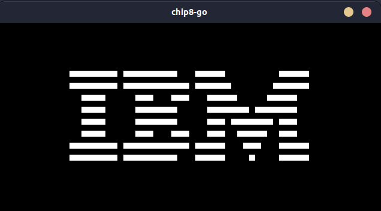

# chip8-go



Chip-8 emulator written in Go.<br>
Goal was to get more comfortable with Go and learning the basics of emulation.

Still in development, currently only supports enough instructions to run the IBM Logo program.

# Install

```console
$ go install github.com/michaelbui99/chip8-go@latest
```

# Running a Chip-8 ROM

```console
$ chip8-go load /PATH/TO/ROM
```

# See all available commands

```console
$ chip-8 -h
```

# References

## High level overview over components that needs to be implemented + specifications

-   https://tobiasvl.github.io/blog/write-a-chip-8-emulator/
